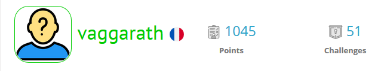

### Bienvenue ! Moi c'est [Vaggarath][website] 👋

## Je suis développeur, bénévole, traducteur et formateur à mes heures perdues !

- 🔭 Mon folio est disponible ici : [Folio][website]!
- 🌱 J'apprends et découvre constamment
- 👯 J'espère bientôt pouvoir collaborer avec d'autres développeurs pour aider mais aussi échanger et apprendre
- 🥅 Je m'intéresse beaucoup à la sécurité et aime apprendre et relever des défis sur RootMe : [Profil][rootme]
- ⚡ Fun fact : Je suis passionné de lecture et fais de la traduction, (scanlation et fansub) depuis la fin des années 90.

### Me contacter :

[][website]
[][linkedin]

 

### Languages and Tools:

[][website]
[][website]
[][website]
[][website]
[][website]
[][website]
[][website]
[][website]
[][website]
[][website]
[][website]
[][website]
[][website]

 
 

---

    
Mon avancée sur Root Me

    

[website]: https://www.vag.ovh
[linkedin]: https://www.linkedin.com/in/julien-chambon-957b77168/
[rootme]: https://www.root-me.org/vaggarath
